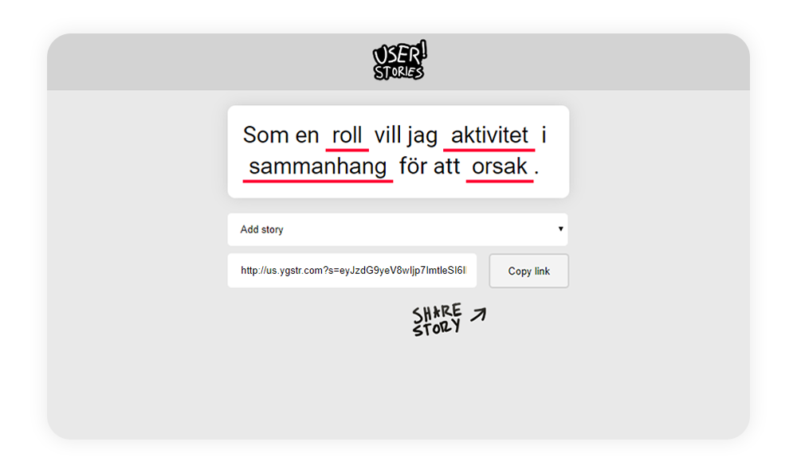

# User stories, https://US.YGSTR.COM
Create user stories and share them with others.

## Features
* No server required, everything will work with static html
* Create your own story templates and share them as well.
* Share a short link (for what it's packing) that includes all your stories and custom templates
* Use CTRL+Z to undo actions and typing.
* For every change, the link is updated making sure you can't lose your stories if you accidentally closed the website (It's in your history)

